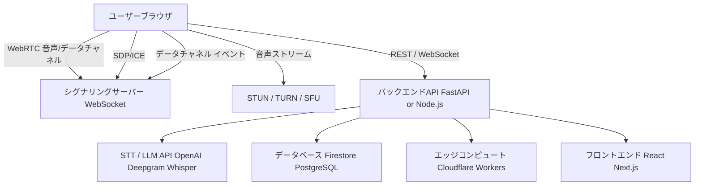

# WebRTCベースのリアルタイム文字起こし・要約機能付きボイスチャット：技術設計仕様書

## はじめに

本書は、音声のテキスト化（Speech-to-Text: STT）を行い、会話の要約を表示することで、途中参加者が議論の内容を即座に把握できるようにする「WebRTCベースのボイスチャットアプリケーション」の包括的な技術設計書です。

本仕様書は以下をカバーします：

* **インフラアーキテクチャ**（クラウドサービス、デプロイ、認証、DB、STT統合、CI/CD）
* **API仕様**（RESTおよびWebSocketエンドポイント、フォーマット、認証）
* **データモデル**（ルーム、参加者、文字起こし、要約のためのFirestore/DBスキーマ）
* **フロントエンド画面設計**（UIコンポーネント、レイアウト、ユーザーフロー）
* **音声処理とSTTフロー**（キャプチャ、チャンク化、バックエンド取り込み、文字起こし、保存）
* **要約生成ロジック**（トリガー、LLM/キーワード抽出、配信）
* **リポジトリ構造**（フロントエンド、バックエンド、インフラ、ドキュメントの推奨フォルダ構成）

---

## 1. インフラアーキテクチャ

### 1.1 概要

**主要コンポーネント:**

* **WebRTC:** リアルタイムかつP2Pの音声ストリーミングに使用。
* **Cloud STT/LLM API:** OpenAI Realtime API, Deepgram, Whisper 等を利用。
* **クラウドデータベース:** Firestore または PostgreSQL（文字起こし、要約、ルーム状態の保存）。
* **エッジコンピュート:** Cloudflare Workers, Realtime Agents（低レイテンシな音声処理）。
* **バックエンドAPI:** FastAPI/Node.js（セッション管理、認証、オーケストレーション）。
* **フロントエンド:** React/Next.js（ユーザー対話とリアルタイム更新）。
* **CI/CD:** GitHub Actions（自動テスト、ビルド、デプロイ）。

### 1.2 WebRTC統合

* **シグナリングサーバー:** WebSocketベース。接続確立のためにSDPとICE候補を交換します。
* **STUN/TURNサーバー:** NAT越えを容易にし、直接P2Pが不可能な場合に通信をリレーします。
* **SFU (Selective Forwarding Unit):** 4人以上のルームにおいて、音声ストリームを効率的にルーティングします。

### 1.3 Speech-to-Text (STT) 統合

* **OpenAI Realtime API:** 低レイテンシでのリアルタイム文字起こしとLLMベースの要約を提供。
* **Deepgram on Cloudflare Workers AI:** グローバル規模で最小限のレイテンシを実現するエッジベースSTT。
* **Whisper (OSS):** ローカルまたはプライバシー重視のデプロイ向け。

### 1.4 データベース

* **Firestore (NoSQL):** リアルタイム同期、およびルーム、参加者、文字起こし、要約の階層型コレクションに適しています。
* **PostgreSQL (SQL):** 高度なクエリ、セマンティック検索（pgvector）、分析用途。

### 1.5 認証

* **JWT (JSON Web Token):** REST/WebSocketエンドポイント向けのステートレスでスケーラブルな認証。
* **エフェメラルキー (Ephemeral keys):** STT/LLM APIへの安全なアクセスのための短命なトークン。
* **OAuth2:** サードパーティ統合用（オプション）。

### 1.6 デプロイ戦略

* **フロントエンド:** Vercel, Netlify, または AWS S3 + CloudFront（静的ホスティングとグローバルCDN）。
* **バックエンド:** Render, Heroku, AWS EC2, DigitalOcean, または Cloudflare Workers（APIおよびシグナリング）。
* **データベース:** マネージドFirestore または AWS RDS/Azure Database。
* **コンテナ化:** ローカル開発およびクラウドデプロイのためのDocker利用。

### 1.7 CI/CD

* **GitHub Actions:** フロントエンド、バックエンド、インフラの自動ビルド・テスト・デプロイパイプライン。
* **Workload Identity:** デプロイ時の安全なクラウド認証（Firebase, GCP）。
* **アーティファクト管理:** ビルドキャッシュ、テストレポート、デプロイログ。

### 1.8 アーキテクチャ図（テキスト表現）



この図は、ブラウザでの音声キャプチャから、WebRTCシグナリングとメディアストリーミング、バックエンドのオーケストレーション、STT/LLM処理、データベース保存までの一連の流れを示しています。

---

## 2. API仕様

### 2.1 RESTエンドポイント

REST APIは、セッション管理、認証、ルーム作成、要約の取得に使用されます。

| エンドポイント | メソッド | 説明 | 認証 |
| --- | --- | --- | --- |
| `/api/v1/session/key` | POST | STT/LLM用の一時APIキーを生成 | JWT |
| `/api/v1/rooms` | POST | 新しいチャットルームを作成 | JWT |
| `/api/v1/rooms/{id}` | GET | ルームの詳細を取得 | JWT |
| `/api/v1/rooms/{id}/join` | POST | ルームに参加 | JWT |
| `/api/v1/rooms/{id}/summary` | GET | 最新の会話要約を取得 | JWT |
| `/api/v1/participants` | GET | ルーム内の参加者をリストアップ | JWT |
| `/api/v1/transcripts` | GET | ルームの文字起こし履歴を取得 | JWT |

**リクエスト/レスポンス例:**

**POST /api/v1/session/key**

```json
{
  "scope": ["realtime"],
  "expiration": 3600
}

```

**Response:**

```json
{
  "ephemeral_key": "sk-ephemeral-xxxx",
  "expires_in": 3600
}

```

### 2.2 WebSocketエンドポイント

WebSocketは、音声ストリーミング、文字起こしの更新、要約の配信などのリアルタイム双方向通信を提供します。

| エンドポイント | 説明 | 認証 |
| --- | --- | --- |
| `/api/v1/ws/signaling` | WebRTCシグナリング (SDP/ICE交換) | JWT |
| `/api/v1/ws/transcribe` | STT用の音声チャンクストリーミング | 一時キー |
| `/api/v1/ws/summary` | クライアントへの会話要約プッシュ通知 | JWT |

**WebSocketメッセージフォーマット:**

**Audio Chunk (クライアント発):**

```json
{
  "type": "audio_chunk",
  "room_id": "abc123",
  "participant_id": "user456",
  "audio": "<base64-encoded PCM>"
}

```

**Transcript Update (サーバー発):**

```json
{
  "type": "transcript_update",
  "room_id": "abc123",
  "participant_id": "user456",
  "text": "Hello, everyone!"
}

```

**Summary Update (サーバー発):**

```json
{
  "type": "summary_update",
  "room_id": "abc123",
  "summary": "The group is discussing project deadlines and next steps."
}

```

### 2.3 認証方法

* **JWT:** RESTおよびWebSocketエンドポイントで使用。`Authorization: Bearer <token>` ヘッダーでトークンを渡します。
* **エフェメラルキー (Ephemeral Key):** STT/LLM APIアクセスに使用。セッションにスコープされた短命なキーで、バックエンドリレー経由以外ではブラウザに公開されません。
* **セキュリティ上の注意:** メインのAPIキーはバックエンドに安全に保存されます。クライアントは、スコープと有効期限が制限されたエフェメラルキーのみを受け取ります。

---

## 3. データモデル

### 3.1 Firestoreスキーマ

リアルタイム同期と階層型データモデリングのためにFirestoreを採用しました。このスキーマは、ルーム、参加者、文字起こし、要約をサポートします。

#### 3.1.1 コレクションとドキュメント

| コレクション | ドキュメントフィールド / サブコレクション |
| --- | --- |
| `rooms` | `id`, `name`, `created_at`, `summary` |
| `participants` (サブ) | (下記参照) |
| `transcripts` (サブ) | (下記参照) |
| `summaries` (サブ) | (下記参照) |
| `participants` | `id`, `name`, `joined_at`, `role` |
| `transcripts` | `id`, `participant_id`, `text`, `timestamp` |
| `summaries` | `id`, `text`, `generated_at`, `trigger_type` |

**構造例:**

```text
rooms/
  {roomId}/
    name: "Project Alpha"
    created_at: <timestamp>
    summary: "Discussing launch timeline."
    participants/
      {participantId}/
        name: "Alice"
        joined_at: <timestamp>
        role: "member"
    transcripts/
      {transcriptId}/
        participant_id: "Alice"
        text: "Let's review the schedule."
        timestamp: <timestamp>
    summaries/
      {summaryId}/
        text: "The team is reviewing the project schedule."
        generated_at: <timestamp>
        trigger_type: "token"

```

#### 3.1.2 データモデル表

| エンティティ | フィールド | 型 | 説明 |
| --- | --- | --- | --- |
| **Room** | `id` | string | 一意なルームID |
|  | `name` | string | ルーム名/タイトル |
|  | `created_at` | timestamp | 作成日時 |
|  | `summary` | string | 最新の要約 |
| **Participant** | `id` | string | 一意な参加者ID |
|  | `name` | string | 表示名 |
|  | `joined_at` | timestamp | 参加日時 |
|  | `role` | string | "member", "admin" 等 |
| **Transcript** | `id` | string | 一意な文字起こしID |
|  | `participant_id` | string | 参加者への参照 |
|  | `text` | string | 文字起こしされたテキスト |
|  | `timestamp` | timestamp | 発話時刻 |
| **Summary** | `id` | string | 一意な要約ID |
|  | `text` | string | 要約テキスト |
|  | `generated_at` | timestamp | 要約生成日時 |
|  | `trigger_type` | string | "token", "time", "event" |

#### 3.1.3 スキーマのベストプラクティス

* 1MBのドキュメントサイズ制限を回避するため、文字起こしと要約にはサブコレクションを使用。
* 効率的なクエリのために、ルーム、参加者、タイムスタンプにインデックスを作成。
* ルームメンバーのみにアクセスを制限するセキュリティルールを設定。

---

## 4. フロントエンド画面設計

### 4.1 主要UIコンポーネント

* **ルーム一覧画面:** 利用可能なルームの表示と参加が可能。
* **参加モーダル:** 表示名の入力、認証、参加処理。
* **ボイスチャット画面:** ライブ会話のメインインターフェース。
* **文字起こしパネル:** 全参加者のリアルタイム文字起こしを表示。
* **要約バナー:** 最新の会話要約を表示。
* **参加者リスト:** 現在の参加者とそのステータスを表示。
* **オーディオコントロール:** ミュート/解除、接続状態、デバイス選択。
* **設定/ヘルプ:** プライバシー情報、トラブルシューティング、フィードバックへのアクセス。

### 4.2 レイアウトとユーザーフロー

#### 4.2.1 ユーザーフローの手順

1. **ランディングページ:** ユーザーは利用可能なルームを見るか、新規作成します。
2. **ルーム参加:** 名前を入力し、認証(JWT)を行い、参加します。
3. **ボイスチャット画面:**
* マイクの許可をリクエスト。
* WebRTC接続を確立。
* 文字起こしパネルにテキストをライブ表示。
* 要約バナーに直近の要約を表示。
* 参加者リストをリアルタイム更新。
* オーディオコントロールで操作可能。


4. **要約の更新:** 新しい要約が生成されるとバナーが更新され、展開して詳細を確認可能。
5. **文字起こし履歴:** 過去の発言へスクロールして確認可能。
6. **退室:** 接続を切断し、セッションを終了。

#### 4.2.2 UIワイヤーフレーム（テキスト）

```text
+-------------------------------------------------------------+
| Room: Project Alpha                                         |
| Participants: Alice, Bob, Carol                             |
|-------------------------------------------------------------|
| [要約バナー]                                                 |
| "チームはローンチのスケジュールと次のステップを議論中..."        |
|-------------------------------------------------------------|
| [文字起こしパネル]                                           |
| Alice: スケジュールを確認しましょう。                         |
| Bob: 来週には間に合うと思います。                             |
| Carol: クライアントにアップデートすべきですか？                |
| ...                                                         |
|-------------------------------------------------------------|
| [オーディオ操作] [ミュート] [デバイス] [接続ステータス]         |
|-------------------------------------------------------------|
| [退室] [設定]                                               |
+-------------------------------------------------------------+

```

#### 4.2.3 コンポーネント詳細

* **文字起こしパネル:** 参加者ごとの色分け、自動スクロール、新規メッセージのハイライト。
* **要約バナー:** 上部に固定（Sticky）、クリックで拡張表示/履歴表示。
* **参加者リスト:** アバター、発話中インジケーター、ミュート状態。
* **オーディオコントロール:** アクセシビリティ対応、レスポンシブ、エラーフィードバック。
* **設定/ヘルプ:** プライバシー情報、トラブルシューティング、フィードバックフォームを含むモーダル。

#### 4.2.4 アクセシビリティとレスポンシブ対応

* **WCAG AA準拠:** キーボードナビゲーション、スクリーンリーダー対応。
* **レスポンシブデザイン:** モバイル、タブレット、デスクトップレイアウト。
* **ライブ更新:** FirestoreリスナーまたはWebSocketイベントによるリアルタイムな文字起こしと要約。

---

## 5. 音声処理とSTTフロー

### 5.1 音声キャプチャとチャンク化

* **Browser API:** `navigator.mediaDevices.getUserMedia({ audio: true })` でマイクにアクセス。
* **AudioWorklet:** 低レイテンシ、マルチスレッドでの音声サンプル処理とチャンク化。
* **チャンク化:** 効率的なストリーミングのため、音声を40msのPCMブロック（24kHzモノラル、16ビット）に分割。

### 5.2 バックエンドへの音声送信

* **WebRTC MediaStream:** SFUまたはバックエンドへの音声ストリーミング用直接ピア接続。
* **DataChannel:** 制御イベントおよび文字起こし/要約の更新用。
* **WebSocket (フォールバック):** WebRTCが利用できない環境や、サーバー間STT用。

### 5.3 バックエンド音声取り込み

* **エッジコンピュート:** Cloudflare Workers等を使用し、低レイテンシな音声取り込みとSTTパイプラインのオーケストレーションを実施。
* **音声フォーマット変換:** 必要に応じてOpusからPCMへ変換（オープンソースライブラリを使用）。
* **発話区間検出 (VAD):** 発話の開始/終了を検出し、チャンクのコミットと文字起こしのセグメンテーションを行います。

### 5.4 Speech-to-Text処理

* **STTプロバイダー:**
* *OpenAI Realtime API:* リアルタイム文字起こし、音声/テキスト両対応、低レイテンシ、Function calling、VAD、コンテキスト管理。
* *Deepgram:* エッジベースSTT、グローバルスケール、低レイテンシ。
* *Whisper:* ローカルまたはサーバーベース、OSS、高精度、プライバシー重視。


* **文字起こしイベント:**
* `audio_chunk`: クライアントからバックエンドへ送信。
* `transcript_partial`: ライブ表示用に返される部分的な文字起こし。
* `transcript_final`: 確定した文字起こし（保存対象）。


### 5.5 文字起こしの保存

* **Firestore:** 文字起こしドキュメントはルーム下のサブコレクションに保存され、参加者とタイムスタンプでインデックス化されます。
* **PostgreSQL:** 高度な分析、セマンティック検索、レポーティング用。

### 5.6 プライバシーとセキュリティ

* **音声および文字起こしデータ:** 転送中は暗号化（TLS）、保存時はアクセス制御（Firestoreルール、DB ACL）。
* **PII/PHI (個人情報/機微情報):** 安全なストレージ、監査証跡、必要に応じてGDPR/HIPAA準拠。

---

## 6. 要約生成ロジック

### 6.1 要約のトリガー

要約は、途中参加者が追いつけるようにするため、およびLLMの長期的なコンテキスト管理のために生成されます。

**トリガー戦略:**

* **トークンベース:** 文字起こしのトークン数が閾値（例: 2000トークン）を超えた場合、古いターンを要約。
* **時間ベース:** N分ごとに要約を生成。
* **イベントベース:** 新しい参加者が加わった時、または主要なトピックが変わった後。

### 6.2 要約生成手法

* **LLMによる再帰的要約:** LLM（例: GPT-4o）を使用して、以前のターンを簡潔な要約に圧縮し、会話の進行に合わせて再帰的に更新します。
* **プロンプトエンジニアリング:** 主要なトピック、人物、文脈に焦点を当てるようLLMをガイドするカスタムプロンプト。
* **キーワード抽出:** 軽量な要約のために、NLPライブラリを使用してキーフレーズを抽出。

**LLMプロンプト例:**

> You are an advanced AI language model. Summarize the following conversation in 3 sentences, focusing on the main topics and decisions. [Conversation transcript]

### 6.3 クライアントへの配信

* **Firestoreリスナー:** クライアントは要約サブコレクションを購読し、リアルタイム更新を受け取ります。
* **WebSocketイベント:** サーバーは `summary_update` メッセージを全接続クライアントにプッシュします。
* **UIバナー:** 要約を目立つように表示し、履歴を展開するオプションを提供します。

### 6.4 要約の保存

* **要約:** `summaries` サブコレクションに保存され、`generated_at` と `trigger_type` でインデックス化されます。
* **履歴:** 文脈と監査のために過去の要約も保持されます。

### 6.5 アルゴリズム詳細

* **再帰的メモリ:** LLMは以前の要約と最新の文字起こしを使用して新しい要約を生成し、長期的な文脈管理を可能にします。
* **相互補完:** 検索ベースとメモリベースのアプローチを組み合わせ、一貫性と整合性を高めます。

### 6.6 パフォーマンスと品質

* **閾値チューニング:** トークンの閾値と要約頻度は、レイテンシと文脈保持のバランスをとるために設定可能です。
* **評価:** 自動および手動の方法を使用して、流暢さ、一貫性、整合性を評価します。

---

## 7. リポジトリ構造

### 7.1 推奨フォルダ構成

メンテナンス性とコラボレーションのために、明確でモジュール化されたリポジトリ構造が不可欠です。

| フォルダ | 目的 |
| --- | --- |
| `frontend/` | React/Next.jsアプリ、UIコンポーネント、状態ロジック |
| `backend/` | FastAPI/Node.jsサーバー、APIルート、シグナリング |
| `infra/` | Infrastructure-as-Code (Terraform, Bicep等) |
| `docs/` | ドキュメント、ガイド、アーキテクチャ図 |
| `tests/` | ユニット/統合/負荷テスト |
| `scripts/` | DevOps, CI/CD, デプロイスクリプト |
| `config/` | アプリ設定、環境テンプレート |
| `.github/` | GitHub Actionsワークフロー |

**ディレクトリツリー例:**

```text
webrtc-voice-chat-app/
├── frontend/
│   ├── src/
│   │   ├── components/
│   │   ├── hooks/
│   │   ├── store/           # Zustand/Redux state management
│   │   ├── utils/
│   │   ├── types/
│   │   ├── styles/
│   │   ├── App.tsx
│   │   └── main.tsx
│   ├── public/
│   ├── dist/
│   ├── tailwind.config.js
│   ├── package.json
│   └── README.md
├── backend/
│   ├── app/
│   │   ├── core/
│   │   ├── api/
│   │   ├── db/
│   │   ├── services/
│   │   ├── utils/
│   │   └── main.py
│   ├── requirements.txt
│   ├── Dockerfile
│   ├── docker-compose.yml
│   ├── .env.example
│   └── README.md
├── infra/
│   ├── terraform/
│   ├── bicep/
│   ├── scripts/
│   └── README.md
├── docs/
│   ├── architecture.md
│   ├── api.md
│   ├── frontend.md
│   ├── backend.md
│   └── README.md
├── tests/
│   ├── frontend/
│   ├── backend/
│   └── load/
├── scripts/
│   ├── deploy.sh
│   ├── setup.sh
│   └── README.md
├── config/
│   ├── appconfig.json
│   └── .env.sample
├── .github/
│   ├── workflows/
│   │   ├── ci.yml
│   │   ├── cd.yml
│   │   └── deploy.yml
│   └── README.md
└── README.md

```

### 7.2 ドキュメント

* **README.md:** プロジェクト概要、セットアップ手順、アーキテクチャ要約。
* **docs/:** 詳細ガイド、APIリファレンス、トラブルシューティング、貢献ガイドライン。
* **アーキテクチャ図:** テキストおよびビジュアル形式でドキュメントに含める。

### 7.3 CI/CDスクリプト

* **.github/workflows/:** ビルド、テスト、デプロイ、アーティファクト管理のためのGitHub Actions。
* **scripts/:** ローカルセットアップ、デプロイ、メンテナンスのためのシェルスクリプト。

### 7.4 設定

* **config/:** 環境テンプレート、アプリ設定ファイル、シークレット管理。

### 7.5 テスト

* **tests/:** フロントエンド、バックエンド、インフラのユニット、統合、負荷テスト。

---

## 8. 状態管理と同期

### 8.1 フロントエンドの状態

* **Zustand:** WebSocketおよび文字起こしデータのための軽量でスケーラブルな状態管理。
* **Redux:** 複雑な状態ロジックが必要な場合のオプション。
* **リアルタイムリスナー:** 文字起こしと要約の更新のための Firestore `onSnapshot`。

### 8.2 同期

* **WebSocketイベント:** 文字起こしと要約の更新用。
* **Firestoreリスナー:** デバイス間のリアルタイム同期用。
* **競合解決:** 文字起こしの編集に対しては、Last-write-wins（後勝ち）またはベクタークロックを採用。

---

## 9. スケーラビリティ、可観測性、コンプライアンス

### 9.1 スケーラビリティ

* **SFUアーキテクチャ:** 大規模ルームのための効率的な多人数音声ルーティング。
* **エッジコンピュート:** 低レイテンシ音声処理のためのCloudflare Workers。
* **データベースシャーディング:** 大量の文字起こし保存に対応。

### 9.2 可観測性 (Observability)

* **ロギング:** API、シグナリング、STTイベントの構造化ログ。
* **メトリクス:** レイテンシ、パケットロス、文字起こし精度、要約生成時間。
* **トレーシング:** デバッグのためのエンドツーエンドのリクエスト追跡。
* **WebRTC分析:** 通話品質監視のためのPeermetricsまたは類似のOSSプラットフォーム。

### 9.3 プライバシー、セキュリティ、コンプライアンス

* **暗号化:** 転送中の全データのTLS暗号化、文字起こしと要約の保存時暗号化。
* **アクセス制御:** Firestoreルール、JWTベースの認可、ロールベースの権限管理。
* **監査証跡:** 文字起こしと要約へのアクセス記録。
* **コンプライアンス:** 文字起こしや録音に含まれるPII/PHIに対するGDPR、HIPAA対応。

---

## 10. オープンソース参考プロジェクト

* **matheus-rech/realtime-transcription-app:** FastAPIバックエンド、WebRTC/WebSocket STT、エフェメラルキー管理。
* **AnnasMustafaDev/voice-assistant-web-app:** マルチエージェント音声プラットフォーム、JWT認証、WebSocketストリーミング、Reactフロントエンド、Dockerデプロイ。
* **saissd/Audio-Data-Research-Pipeline:** WebRTC録音、FFmpeg前処理、S3保存、Prisma/PostgreSQLメタデータ、FastAPI ASR統合。
* **KoljaB/RealtimeSTT:** VAD、ウェイクワード、Whisper統合を備えたリアルタイムSTT。
* **pipecat-ai/voice-ui-kit:** 音声AIアプリ向けのReactコンポーネントとフック。

---

## 11. 技術スタック概要

| レイヤー | 技術 | 選定理由 |
| --- | --- | --- |
| **フロントエンド** | React, Next.js, Zustand | モダン、スケーラブル、リアルタイムUI |
| **バックエンド** | FastAPI, Node.js | 非同期、スケーラブルなAPI、WebSocketサポート |
| **データベース** | Firestore, PostgreSQL | リアルタイム同期、高度なクエリ |
| **STT/LLM** | OpenAI Realtime API, Deepgram, Whisper | 低レイテンシ、正確な文字起こし |
| **エッジコンピュート** | Cloudflare Workers | グローバルスケール、最小限のレイテンシ |
| **音声** | WebRTC, AudioWorklet | ネイティブブラウザサポート、低レイテンシ |
| **CI/CD** | GitHub Actions | 自動ビルド、テスト、デプロイ |
| **コンテナ** | Docker | 一貫した開発/本番環境 |
| **可観測性** | Peermetrics, Logging | 通話品質、デバッグ、分析 |
| **セキュリティ** | JWT, Ephemeral Keys | スケーラブルで安全な認証 |

---

## 12. 実装チェックリスト

* [ ] WebRTCシグナリングと音声ストリーミング
* [ ] STT/LLM API用の安全なエフェメラルキー管理
* [ ] リアルタイムの文字起こしと要約生成
* [ ] スケーラブルなFirestore/PostgreSQLスキーマ
* [ ] レスポンシブでアクセシブルなフロントエンドUI
* [ ] 自動CI/CDパイプライン
* [ ] 低レイテンシのためのエッジベース音声処理
* [ ] 可観測性と分析の統合
* [ ] プライバシー、セキュリティ、コンプライアンス管理
* [ ] モジュール化され文書化されたリポジトリ構造
